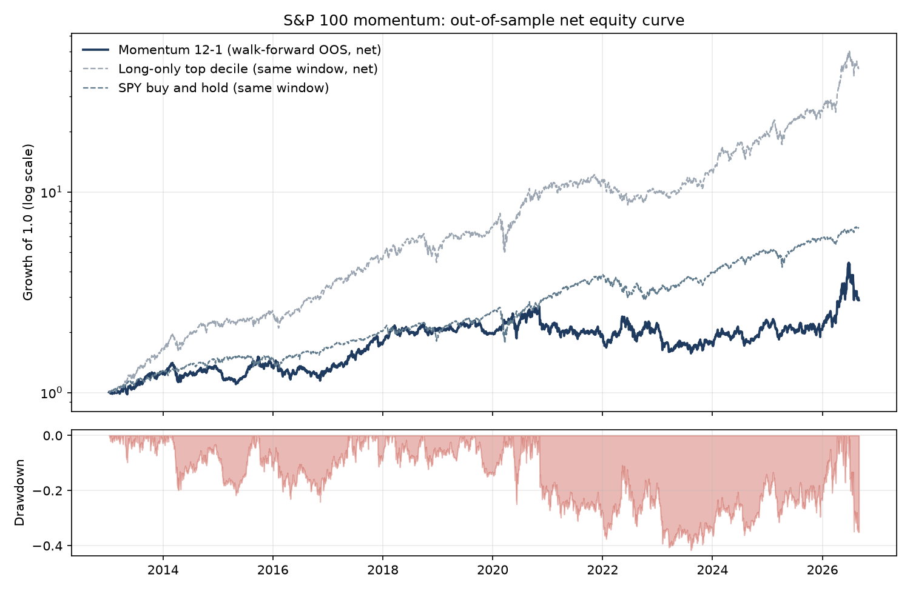
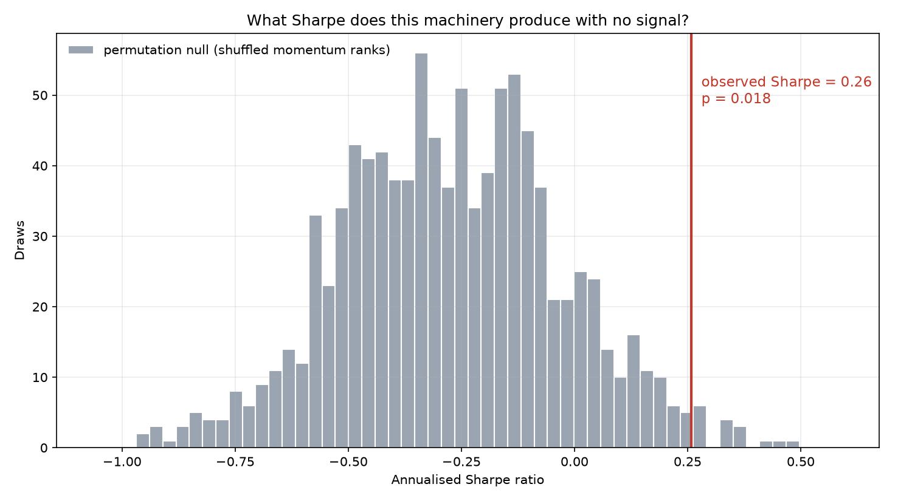
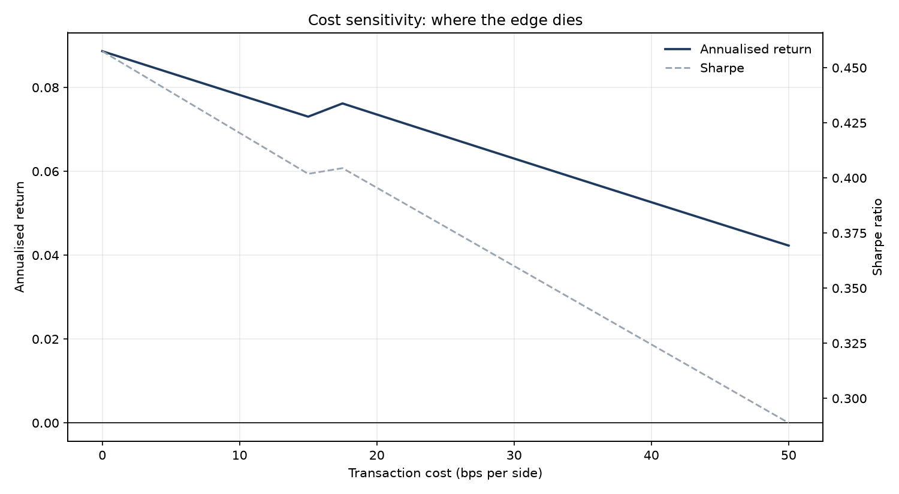

# S&P 100 Momentum, Audited

A deliberately unoriginal signal — 12-1 cross-sectional momentum — put through an
audit harness strong enough to tell whether its edge is distinguishable from noise,
from data mining, and from transaction costs.

**The originality here is the audit, not the alpha.** The signal is textbook. The
question is whether the standard evidence for it survives contact with a null
distribution, a walk-forward split, a 32-configuration sweep with multiple-testing
correction, and realistic costs.

## Verdict

Long-short 12-1 momentum on the current S&P 100, {{data_start}} to {{data_end}},
equal-weight, dollar-neutral, monthly rebalance, {{bps}} bps per side, **{{verdict_word}}
the audit.**

The full-sample Sharpe is **{{baseline_sharpe}}**. The permutation null — the identical
engine run {{permutation_draws}} times on randomly shuffled momentum ranks, paying the
same costs and turning over the same way — produces a Sharpe of {{permutation_mean}} on
average with a standard deviation of {{permutation_std}}, and its 95th percentile is
{{permutation_q95}}. That puts the observed Sharpe at **p = {{permutation_pvalue}}**.

Walk-forward, where parameters are chosen only on data preceding each evaluation window,
the Sharpe falls to **{{oos_sharpe}}** — a decay of **{{is_oos_gap}}** from the
in-sample mean of {{mean_is_sharpe}}.

Across the {{n_configs}}-configuration sweep the best result is
`{{best_config_key}}` at Sharpe {{best_config_sharpe}}. Under the sweep-max null — the
best of all {{n_configs}} configurations, {{sweep_max_draws}} times, on shuffled signal —
that best-of-grid result carries **p = {{sweep_max_pvalue}}**, with a null 95th
percentile of {{sweep_max_q95}}. The Deflated Sharpe Ratio, accounting for
{{n_configs}} trials plus the skew and kurtosis of the returns, is **{{dsr}}**.
Bonferroni at the {{bonferroni_threshold}} threshold leaves **{{bonferroni_survivors}}**
of {{n_configs}} configurations standing ({{bonferroni_raw_survivors}} survive an
uncorrected 0.05).

The out-of-sample edge reaches zero at **{{breakeven_bps_oos}}**.





## Headline numbers

| Metric | Value |
|---|---|
| Full-sample Sharpe | {{baseline_sharpe}} |
| Walk-forward OOS Sharpe | {{oos_sharpe}} |
| In-sample to OOS decay | {{is_oos_gap}} |
| Annualised return (full sample, net) | {{baseline_ann_return}} |
| Annualised volatility | {{baseline_ann_vol}} |
| Max drawdown | {{max_drawdown}} |
| Annual one-way turnover | {{turnover}}x |
| Monthly hit rate | {{hit_rate}} |
| Permutation null p-value | {{permutation_pvalue}} |
| Block bootstrap p-value | {{bootstrap_pvalue}} |
| Deflated Sharpe Ratio ({{n_configs}} trials) | {{dsr}} |
| Sweep-max p-value | {{sweep_max_pvalue}} |
| Bonferroni survivors | {{bonferroni_survivors}} of {{n_configs}} |
| OOS breakeven cost | {{breakeven_bps_oos}} |
| Long-only top decile Sharpe | {{long_only_sharpe}} |
| SPY buy-and-hold Sharpe | {{spy_sharpe}} |



## What this study cannot tell you

The universe is the **current** S&P 100, scraped on {{universe_scraped_on}}:
{{n_tickers}} tickers, held fixed across the whole history. Point-in-time membership
is not available from the data source, and pretending otherwise would be the exact
failure this project exists to avoid. So:

| Bias | Mechanism | Direction |
|---|---|---|
| Survivorship | Only firms in the index today are studied. The delisted, acquired, and collapsed are absent. | Inflates returns, especially the short leg, which never gets to short a name into oblivion. |
| Look-ahead universe selection | 2026 membership is used to trade 2010. Index membership is itself a momentum-like filter. | Inflates the long leg. |
| Adjusted-price restatement | Adjusted prices reflect corporate actions known today. | Small, direction ambiguous. |

A positive result under these biases is weak evidence. A negative result under them
is strong evidence — the biases were pushing in favour of the strategy and it still
did not clear the bar.

Also not modelled: borrow cost and availability for the short leg, market impact
beyond a flat per-side fee, financing, taxes, and any capacity constraint. Every one
of these makes the real strategy worse than the one measured here.

## Method

**Data.** Daily adjusted closes from `yfinance`, {{data_start}} to {{data_end}},
{{n_tickers}} tickers, committed to `data/prices.parquet` so results do not drift as
the vendor restates history. A ticker becomes tradable only once it has 252 trading
days of history.

**Signal.** At each month end, the return from 12 months ago to 1 month ago. The most
recent month is skipped to sidestep short-term reversal. Ranked cross-sectionally; a
rebalance date with fewer than 40 valid names is skipped.

**Execution.** Weights formed from information at the close of month-end `t` are
shifted two trading days: the position is established on `t+1` and first earns on
`t+2`. This invariant is enforced by `tests/test_engine.py`, which runs an oracle
signal that knows next month's returns and asserts both that the real engine cannot
profit from it and that an engine without the shift can — so the test cannot pass
vacuously. (Note: this tests that `run_backtest`'s lag shift mechanism cannot be
bypassed by an off-by-one error; it does not claim end-to-end lookahead safety across
all potential upstream preprocessing steps.)

**Costs.** {{bps}} bps per side, charged on the full absolute weight change whenever
the book turns over.

**Walk-forward.** Five expanding-window folds. Each fold selects the best of
{{n_configs}} configurations on data strictly preceding its evaluation window. The
headline equity curve is the stitched out-of-sample series only.

**Nulls.** The permutation null shuffles momentum ranks across names at each rebalance
and reruns the whole engine, preserving cross-sectional covariance, turnover, and cost
drag while destroying the signal. The stationary block bootstrap (Politis-Romano, mean
block 21 days) resamples the demeaned return series. {{permutation_draws}} and
{{bootstrap_draws}} draws respectively.

**Multiple testing.** All three corrections are reported, not just the flattering one:
Deflated Sharpe Ratio at {{n_configs}} trials, Bonferroni on per-configuration
permutation p-values, and the sweep-max null — {{sweep_max_draws}} draws in which every
configuration runs on the same shuffled signal and only the best is kept.

## Reproduce it

```bash
python3.11 -m venv .venv
.venv/bin/pip install -r requirements.txt
.venv/bin/pytest                       # the audit's own audit
.venv/bin/python scripts/run_audit.py  # regenerates results/audit.json and figures/
.venv/bin/python scripts/render_readme.py
```

The committed `data/prices.parquet` means the first three commands need no network.
`scripts/download.py` is the only module that fetches anything, and rerunning it will
produce slightly different results as the index membership and adjusted history move.

Run recorded in `results/audit.json`: commit `{{git_commit}}`, run on {{run_on}},
seed {{seed}}.

## Repo layout

```
momaudit/       data, signal, engine, metrics, walkforward, nulls, sweep, costs, plots
scripts/        download.py (the only network access), run_audit.py, render_readme.py
tests/          including the adversarial no-lookahead test
results/        audit.json — every number in this README comes from here
figures/        the three plots
docs/           design spec and implementation plan
```
